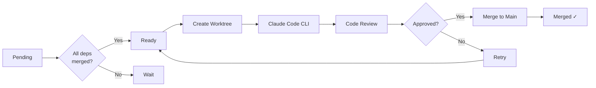

# Insurance Homepage LangGraph Orchestrator

A LangGraph-based orchestrator that coordinates **Claude Code CLI** subprocesses for parallel feature development with **git worktrees** and **automated code review**.

## Architecture

```
┌─────────────────────────────────────────────────────────────────┐
│                     LangGraph Orchestrator                       │
├─────────────────────────────────────────────────────────────────┤
│                                                                  │
│  ┌──────────┐    ┌──────────────┐    ┌────────────────┐         │
│  │  Load    │───▶│  Init        │───▶│  Check Ready   │         │
│  │  Data    │    │  Project     │    │  Stories       │         │
│  └──────────┘    └──────────────┘    └───────┬────────┘         │
│                                              │                   │
│                                              ▼                   │
│  ┌──────────────────────────────────────────────────────────┐   │
│  │                     Story Loop                            │   │
│  │  ┌────────────┐  ┌─────────────┐  ┌────────────┐         │   │
│  │  │  Select    │─▶│   Create    │─▶│    Code    │         │   │
│  │  │  Story     │  │   Worktree  │  │   Feature  │         │   │
│  │  └────────────┘  └─────────────┘  └──────┬─────┘         │   │
│  │                                          │                 │   │
│  │                                          ▼                 │   │
│  │  ┌────────────┐  ┌─────────────┐  ┌────────────┐         │   │
│  │  │   Check    │◀─│   Review    │◀─│   Merge    │         │   │
│  │  │   Ready    │  │   Feature   │  │   to Main  │         │   │
│  │  └─────┬──────┘  └─────────────┘  └────────────┘         │   │
│  │        │                │                                 │   │
│  │        │                ▼                                 │   │
│  │        │         ┌────────────┐                           │   │
│  │        └────────▶│   Retry    │──▶ (if rejected)          │   │
│  │                  │  (cleanup) │                           │   │
│  │                  └────────────┘                           │   │
│  └──────────────────────────────────────────────────────────┘   │
│                                                                  │
└─────────────────────────────────────────────────────────────────┘

Each Claude Code CLI instance runs in an isolated git worktree:
┌────────────────────────────────────────────────────┐
│  Git Worktree: feature/US-01-cta-button            │
├────────────────────────────────────────────────────┤
│  • Claude Code CLI subprocess                      │
│  • Implements feature based on story              │
│  • Files created/modified tracked                  │
│  • Branch: feature/US-01-cta-button               │
└────────────────────────────────────────────────────┘
```

## Features

- **Dependency-aware processing**: Stories are processed in topological order
- **Isolated development**: Each story gets its own git worktree
- **Parallel execution**: Multiple worktrees can be processed simultaneously
- **Automated code review**: Claude-powered review checks against acceptance criteria
- **Auto-merge**: Approved features are merged to main branch
- **Rich CLI**: Beautiful terminal output with progress tracking

## Installation

```bash
cd langgraph_insurance
pip install -e .
```

## Dependencies

- Python 3.11+
- LangGraph
- Claude Code CLI (`claude`) installed and in PATH
- Git
- Node.js (for project initialization)

## Usage

### List all stories
```bash
python -m src.main --list
```

### Dry run (show what would happen)
```bash
python -m src.main --dry-run
```

### Process specific stories
```bash
python -m src.main --stories-filter US-01 US-02 US-03
```

### Process all stories
```bash
python -m src.main
```

### With custom paths
```bash
python -m src.main \
  --project /path/to/project \
  --stories /path/to/stories.json \
  --graph /path/to/graph.json
```

## Project Structure

```
langgraph_insurance/
├── pyproject.toml           # Project configuration
├── README.md                # This file
├── data/
│   ├── insurance-homepage-stories.json
│   └── insurance-homepage-dependency-graph.json
└── src/
    ├── __init__.py          # Package exports
    ├── main.py              # CLI entry point
    ├── models.py            # Data models
    ├── orchestrator.py      # LangGraph orchestrator
    ├── claude_code.py       # Claude Code CLI wrapper
    ├── worktree_manager.py  # Git worktree management
    └── code_reviewer.py     # Automated code reviewer
```

## How It Works

1. **Load Data**: Load 50 user stories and dependency graph from JSON
2. **Dependency Resolution**: Identify stories ready to work on (all deps merged)
3. **Create Worktree**: For each story, create an isolated git worktree
4. **Execute Claude Code**: Run Claude Code CLI with story prompt in worktree
5. **Automated Review**: Claude reviews code against acceptance criteria
6. **Merge to Main**: If approved, merge branch to main
7. **Repeat**: Continue until all stories are processed

## Story Processing Flow



## Configuration

### Environment Variables

- `ANTHROPIC_API_KEY`: API key for Claude code review
- `CLAUDE_CODE_PATH`: Path to Claude Code CLI (default: `claude`)

### Adjusting Max Parallel Worktrees

```bash
python -m src.main --max-parallel 4
```

## Output

The orchestrator produces:

- **Git worktrees**: Isolated development environments at `../worktrees/`
- **Branches**: Each story gets `feature/{story-id}-{title}` branch
- **Merges**: Approved features merged to `main`
- **Logs**: Detailed execution logs with timestamps

## Example Output

```
╔══════════════════════════════════════════════════════════════════╗
║         Insurance Homepage LangGraph Orchestrator                ║
╚══════════════════════════════════════════════════════════════════╝

[09:30:15] Loading user stories and dependency graph...
[09:30:15] Loaded 50 stories
[09:30:16] Initializing project structure...
[09:30:16] Project already exists
[09:30:16] Ready stories: ['US-01', 'US-09', 'US-16', 'US-26', 'US-34', 'US-39', 'US-44']
[09:30:16] Selected story: US-01 - Hero Banner
[09:30:16] Creating worktree for US-01...
[09:30:17] Worktree created: us-01-hero-banner
[09:30:17] Executing Claude Code for: US-01
...

✓ Orchestrator finished!

Summary:
  Completed: 12
  Failed: 0

Merged to main:
  ✓ US-01
  ✓ US-02
  ✓ US-09
  ...
```

## License

MIT