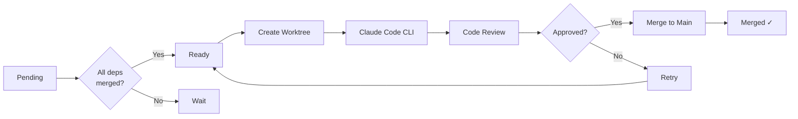

# LangGraph Insurance Orchestrator

<div align="center">


**A LangGraph-based orchestrator that coordinates Claude Code CLI subprocesses for parallel feature development with git worktrees and automated code review.**

</div>

---

## Table of Contents

- [Overview](#overview)
- [Features](#features)
- [Architecture](#architecture)
- [Prerequisites](#prerequisites)
- [Installation](#installation)
- [Quick Start](#quick-start)
- [Usage](#usage)
- [How It Works](#how-it-works)
- [Adding New Stories](#adding-new-stories)
- [Project Structure](#project-structure)
- [Configuration](#configuration)
- [Troubleshooting](#troubleshooting)
- [Contributing](#contributing)
- [License](#license)

---

## Overview

This project demonstrates a sophisticated AI-powered software development orchestration system that:

1. Reads **user stories** and their **dependencies** from JSON files
2. Resolves **topological order** based on dependencies
3. Creates **isolated git worktrees** for each feature
4. Invokes **Claude Code CLI** as a subprocess to implement features
5. Runs **automated code review** using Claude
6. **Merges approved features** to main branch

> **Note:** This is a reference implementation showcasing LangGraph patterns, Claude Code CLI automation, and git worktree management. It requires Claude Code CLI to be installed.

---

## Features

- **Dependency-aware Processing**: Stories are processed in topological order based on their dependencies
- **Isolated Development**: Each story gets its own git worktree (branch + directory)
- **Parallel Execution**: Multiple worktrees can be processed (configurable)
- **Automated Code Review**: Claude-powered review checks against acceptance criteria
- **Auto-merge**: Approved features are merged to main branch automatically
- **Cross-platform**: Works on Windows, macOS, and Linux
- **Checkpointing**: LangGraph memory checkpointer for crash recovery
- **Rich CLI**: Beautiful terminal output with progress tracking

---

## Architecture

```
┌─────────────────────────────────────────────────────────────────┐
│                     LangGraph Orchestrator                       │
├─────────────────────────────────────────────────────────────────┤
│                                                                  │
│  ┌──────────┐    ┌──────────────┐    ┌────────────────┐         │
│  │  Load    │───▶│  Init        │───▶│  Check Ready   │         │
│  │  Data    │    │  Project     │    │  Stories       │         │
│  └──────────┘    └──────────────┘    └───────┬────────┘         │
│                                              │                   │
│                                              ▼                   │
│  ┌──────────────────────────────────────────────────────────┐   │
│  │                     Story Loop                            │   │
│  │  ┌────────────┐  ┌─────────────┐  ┌────────────┐         │   │
│  │  │  Select    │─▶│   Create    │─▶│    Code    │         │   │
│  │  │  Story     │  │   Worktree  │  │   Feature  │         │   │
│  │  └────────────┘  └─────────────┘  └──────┬─────┘         │   │
│  │                                          │                 │   │
│  │                                          ▼                 │   │
│  │  ┌────────────┐  ┌─────────────┐  ┌────────────┐         │   │
│  │  │   Check    │◀─│   Review    │◀─│   Merge    │         │   │
│  │  │   Ready    │  │   Feature   │  │   to Main  │         │   │
│  │  └─────┬──────┘  └─────────────┘  └────────────┘         │   │
│  │        │                │                                 │   │
│  │        │                ▼                                 │   │
│  │        │         ┌────────────┐                           │   │
│  │        └────────▶│   Retry    │──▶ (if rejected)          │   │
│  │                  │  (cleanup) │                           │   │
│  │                  └────────────┘                           │   │
│  └──────────────────────────────────────────────────────────┘   │
│                                                                  │
└─────────────────────────────────────────────────────────────────┘

Each Claude Code CLI instance runs in an isolated git worktree:
┌────────────────────────────────────────────────────┐
│  Git Worktree: feature/US-01-cta-button            │
├────────────────────────────────────────────────────┤
│  • Claude Code CLI subprocess                      │
│  • Implements feature based on story              │
│  • Files created/modified tracked                  │
│  • Branch: feature/US-01-cta-button               │
└────────────────────────────────────────────────────┘
```

---

## Prerequisites

### Required Software

| Software | Version | Purpose |
|----------|---------|---------|
| **Python** | 3.11+ | Runtime |
| **Git** | 2.0+ | Version control & worktrees |
| **Node.js** | 18+ | Required for Claude Code CLI |
| **Claude Code CLI** | Latest | AI coding assistant |

### Installing Prerequisites

#### macOS

```bash
# Install Homebrew (if not installed)
/bin/bash -c "$(curl -fsSL https://raw.githubusercontent.com/Homebrew/install/HEAD/install.sh)"

# Install Python
brew install python@3.11

# Install Git
brew install git

# Install Node.js (for Claude Code CLI)
brew install node

# Install Claude Code CLI
npm install -g @anthropic-ai/claude-code
```

#### Linux (Ubuntu/Debian)

```bash
# Update package list
sudo apt update

# Install Python
sudo apt install python3.11 python3.11-venv python3-pip

# Install Git
sudo apt install git

# Install Node.js
curl -fsSL https://deb.nodesource.com/setup_18.x | sudo -E bash -
sudo apt install nodejs

# Install Claude Code CLI
sudo npm install -g @anthropic-ai/claude-code
```

#### Windows

```powershell
# Install Python from Microsoft Store or python.org
# Download from: https://www.python.org/downloads/windows/

# Install Git from git-scm.com or via winget
winget install Git.Git

# Install Node.js
winget install OpenJS.NodeJS

# Install Claude Code CLI (in PowerShell or CMD)
npm install -g @anthropic-ai/claude-code
```

### Verify Installation

```bash
# Check Python version
python3 --version
# Should output: Python 3.11.x or higher

# Check Git version
git --version
# Should output: git version 2.x.x

# Check Node.js version
node --version
# Should output: v18.x.x or higher

# Check Claude Code CLI
claude --version
# Should output version information
```

---

## Installation

### 1. Clone the Repository

```bash
git clone https://github.com/Saitarun251/langgraph-insurance-orchestrator.git
cd langgraph-insurance-orchestrator
```

### 2. Create Virtual Environment (Recommended)

#### macOS/Linux

```bash
# Create virtual environment
python3 -m venv venv

# Activate virtual environment
source venv/bin/activate

# Your terminal should now show (venv) prefix
```

#### Windows

```powershell
# Create virtual environment
python -m venv venv

# Activate virtual environment
.\venv\Scripts\Activate.psql

# Or in CMD:
# .\venv\Scripts\activate.bat
```

### 3. Install Dependencies

```bash
# Upgrade pip (optional but recommended)
pip install --upgrade pip

# Install all dependencies
pip install -e .

# Or install from requirements.txt
pip install -r requirements.txt
```

### 4. Verify Installation

```bash
# Run platform info check
python -m src.platform_utils

# Should output:
# Platform Info:
#   system: darwin
#   python_version: 3.11.x
#   has_git: True
#   has_claude: True
```

---

## Quick Start

### List All Stories

```bash
python -m src.main --list
```

This displays a table of all 50 user stories with their categories, priorities, and dependencies.

### Dry Run (Preview Mode)

```bash
# Preview what would happen without executing
python -m src.main --dry-run
```

This shows which stories would be processed and the expected workflow.

### Process Specific Stories

```bash
# Process only stories US-01, US-02, and US-03
python -m src.main --stories-filter US-01 US-02 US-03
```

### Run Full Orchestrator

```bash
# Process all stories (requires Claude Code CLI)
python -m src.main
```

---

## Usage

### Command-Line Interface

```bash
python -m src.main [OPTIONS]
```

#### Options

| Option | Description | Default |
|--------|-------------|---------|
| `--project PATH` | Path to the insurance homepage project | Auto-detected |
| `--stories PATH` | Path to stories JSON file | `data/insurance-homepage-stories.json` |
| `--graph PATH` | Path to dependency graph JSON | `data/insurance-homepage-dependency-graph.json` |
| `--stories-filter ID [ID ...]` | Process only these story IDs | All stories |
| `--max-parallel N` | Max parallel worktrees | 2 |
| `--dry-run` | Show what would happen | False |
| `--list` | List all stories and exit | False |

### Examples

#### Basic Usage

```bash
# List all available stories
python -m src.main --list

# Process a subset of stories
python -m src.main --stories-filter US-01 US-09 US-16

# Preview with dry run
python -m src.main --dry-run --stories-filter US-01
```

#### Advanced Usage

```bash
# Custom project path
python -m src.main --project /path/to/my-project

# Custom data files
python -m src.main \
  --stories /path/to/custom-stories.json \
  --graph /path/to/custom-graph.json

# Increase parallelism
python -m src.main --max-parallel 4
```

### Programmatic Usage

```python
from src.orchestrator import InsuranceOrchestrator

# Create orchestrator
orchestrator = InsuranceOrchestrator(
    project_path="/path/to/project",
    stories_path="data/stories.json",
    graph_path="data/graph.json",
)

# Run for specific stories
result = orchestrator.run_sync(story_ids=["US-01", "US-02"])

# Access results
print(f"Completed: {result.completed_stories}")
print(f"Failed: {result.failed_stories}")
print(f"Logs: {result.processing_logs}")
```

---

## How It Works

### Story Processing Flow



### Dependency Resolution

Stories are processed in topological order. A story becomes "ready" when all its dependencies have been merged to main.

**Example:**
```
US-01 (Hero Banner)        → No dependencies, ready immediately
US-02 (CTA Button)         → Depends on US-01, waits until US-01 is merged
US-03 (Background Carousel)→ Depends on US-01, waits until US-01 is merged
US-04 (Auto-rotate)        → Depends on US-03, waits until US-03 is merged
```

### Claude Code CLI Invocation

Each story generates a comprehensive prompt including:
- Story details (As a, I want, So that)
- Dependencies already implemented
- Acceptance criteria
- Technical context (Tailwind, Framer Motion)

```bash
# Claude Code CLI is invoked with:
claude --print --max-turns=10 --approval-mode=bypass
```

### Code Review

After implementation, Claude reviews the code against:
1. **Functionality** - Does it meet acceptance criteria?
2. **Code Quality** - Clean, organized, maintainable?
3. **Tailwind/CSS** - Correct usage of classes?
4. **Accessibility** - ARIA labels, semantic HTML?
5. **Responsive Design** - Mobile/tablet/desktop support?
6. **Animations** - Framer Motion usage correct?

---

## Adding New Stories

The system is fully data-driven. Just update the JSON files:

### 1. Add to Stories File

Edit `data/insurance-homepage-stories.json`:

```json
{
  "id": "US-51",
  "category": "Footer",
  "priority": "Should Have",
  "title": "Dark Mode Toggle",
  "asA": "visitor",
  "iWant": "to toggle dark mode",
  "soThat": "I can reduce eye strain at night",
  "dependencies": ["US-44"],
  "acceptanceCriteria": [
    "Toggle button is visible in footer",
    "Theme switches immediately on click",
    "Preference persists on reload"
  ]
}
```

### 2. Add to Dependency Graph

Edit `data/insurance-homepage-dependency-graph.json`:

```json
{
  "id": "US-51",
  "label": "Dark Mode Toggle",
  "category": "Footer"
}
```

Add to `edges` array:
```json
{"from": "US-44", "to": "US-51", "label": "requires"}
```

### 3. Run

```bash
python -m src.main --stories-filter US-51
```

---

## Project Structure

```
langgraph_insurance_orchestrator/
├── README.md                                    # This file
├── LICENSE                                      # MIT License
├── .gitignore                                   # Git ignore patterns
├── pyproject.toml                               # Python project config
├── requirements.txt                             # pip dependencies
│
├── data/
│   ├── insurance-homepage-stories.json          # 50 user stories
│   └── insurance-homepage-dependency-graph.json # Dependency graph
│
└── src/
    ├── __init__.py                             # Package exports
    ├── main.py                                 # CLI entry point
    │
    ├── models.py                               # Data models
    │   ├── Story                              # User story with metadata
    │   ├── StoryStatus                         # PENDING, IN_PROGRESS, etc.
    │   ├── Priority                            # MUST/SHOULD/COULD/WON'T
    │   ├── DependencyGraph                     # Graph structure
    │   └── WorktreeInfo                        # Git worktree metadata
    │
    ├── orchestrator.py                         # Main LangGraph
    │   ├── OrchestratorState                   # Pydantic state model
    │   ├── load_data_node                      # Load stories/graphs
    │   ├── check_ready_node                    # Dependency resolution
    │   ├── select_story_node                   # Priority-based selection
    │   ├── create_worktree_node                # Git worktree creation
    │   ├── code_feature_node                   # Claude Code invocation
    │   ├── review_feature_node                 # Automated review
    │   ├── merge_to_main_node                  # Merge approved code
    │   └── cleanup_retry_node                  # Handle failures
    │
    ├── claude_code.py                          # Claude Code wrapper
    │   ├── ClaudeCodeCLI                       # CLI subprocess wrapper
    │   └── ClaudeCodeManager                   # Multi-instance manager
    │
    ├── worktree_manager.py                     # Git worktree management
    │   ├── GitWorktreeManager                  # Worktree CRUD operations
    │   └── init_insurance_project()            # Project initialization
    │
    ├── code_reviewer.py                        # Automated review
    │   ├── CodeReviewer                        # Claude-powered reviewer
    │   └── ReviewResult                        # Review output
    │
    └── platform_utils.py                        # Cross-platform utilities
        ├── is_claude_code_available()          # CLI detection
        ├── find_executable()                   # PATH lookup
        └── get_platform_info()                 # Debug info
```

---

## Configuration

### Environment Variables

| Variable | Description | Default |
|----------|-------------|---------|
| `ANTHROPIC_API_KEY` | Anthropic API key for Claude review | Required for code review |

### Claude Code CLI Settings

The orchestrator uses these Claude Code CLI flags:

```bash
claude --print --max-turns=10 --approval-mode=bypass
```

| Flag | Purpose |
|------|---------|
| `--print` | Non-interactive mode |
| `--max-turns=10` | Max Claude iterations per story |
| `--approval-mode=bypass` | Auto-approve file writes |

### Adjusting Behavior

Edit `src/orchestrator.py`:

```python
# Increase timeout (seconds)
timeout=300  # 5 minutes per story

# Increase max Claude turns
"--max-turns=10"  # More iterations per story

# Adjust parallelism
max_parallel=2  # Concurrent worktrees
```

---

## Troubleshooting

### Common Issues

#### 1. "Claude Code CLI not found"

```bash
# Install Claude Code CLI
npm install -g @anthropic-ai/claude-code

# Verify installation
claude --version
```

#### 2. "Git is not installed"

```bash
# macOS
brew install git

# Ubuntu/Debian
sudo apt install git

# Windows
winget install Git.Git
```

#### 3. Permission denied errors

```bash
# Fix npm permissions (macOS/Linux)
sudo chown -R $(whoami) ~/.npm
npm install -g @anthropic-ai/claude-code

# Or use npx (no install required)
npx @anthropic-ai/claude-code ...
```

#### 4. Python version mismatch

```bash
# Check Python version
python3 --version

# Use pyenv for version management
pyenv install 3.11.0
pyenv local 3.11.0
```

#### 5. Virtual environment issues

```bash
# Recreate virtual environment
rm -rf venv
python3 -m venv venv
source venv/bin/activate  # macOS/Linux
pip install -e .
```

### Debug Mode

```bash
# Run with verbose output
python -m src.main --dry-run --stories-filter US-01

# Check platform info
python -c "from src.platform_utils import get_platform_info; print(get_platform_info())"
```

### Getting Help

```bash
# List all available commands
python -m src.main --help

# View story details
python -m src.main --list | grep "US-01"
```

---

## Contributing

Contributions are welcome! Here's how to contribute:

### Development Setup

```bash
# Fork the repository
# Clone your fork
git clone https://github.com/YOUR_USERNAME/langgraph-insurance-orchestrator.git
cd langgraph-insurance-orchestrator

# Create a feature branch
git checkout -b feature/your-feature-name

# Make changes and commit
git add .
git commit -m "Add: your feature description"

# Push and create PR
git push origin feature/your-feature-name
```

### Code Style

- Follow PEP 8
- Use type hints
- Write docstrings for all public functions
- Add tests for new features

### Reporting Issues

1. Check existing issues
2. Create a new issue with:
   - Platform (Windows/macOS/Linux)
   - Python version
   - Error message
   - Steps to reproduce

---

## License

This project is licensed under the MIT License - see the [LICENSE](LICENSE) file for details.

---

## Acknowledgments

- [LangGraph](https://langchain-ai.github.io/langgraph/) - For the state machine framework
- [Claude](https://claude.ai) - For AI-powered code generation and review
- [Git Worktrees](https://git-scm.com/docs/git-worktree) - For isolated development

---

<div align="center">

**Star this repo if you find it useful!**

Made with ❤️ by [Saitarun251](https://github.com/Saitarun251)

</div>